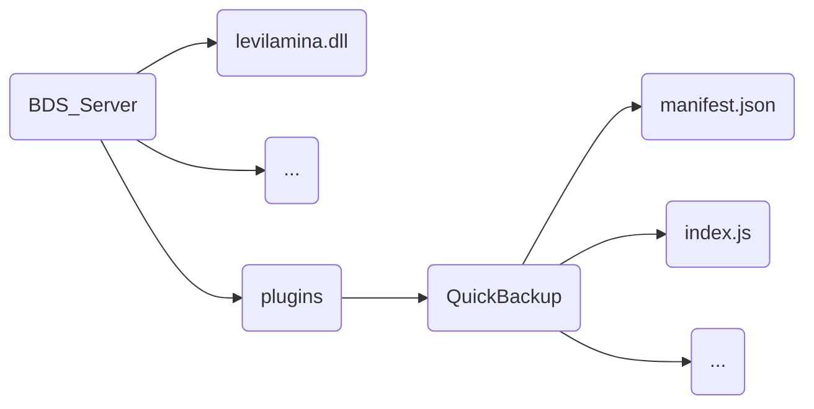

# QuickBackup


# README.md
- en [English](readme/README.en.md)
- zh_CN [简体中文](README.md)


# QuickBackup

**简介**

本插件运行在使用了 **levilamina/LiteloaderBDS** 的 **BDS服务器** 上。使用本插件可以更好地帮助你对服务器进行安全的热备份，不用担心存档丢失；同时提供了方便的定时执行系统，免去另找其它定时执行工具的麻烦。

**依赖**

本插件依赖于 **legacy-script-engine-nodejs**，请在安装本插件前先安装 [**legacy-script-engine-nodejs**](https://github.com/LiteLDev/LegacyScriptEngine)。

**安装**
### 从release下载（推荐）
对于 **levilamina**，你可以直接解压缩本插件的压缩包，然后将其像下图所示，放到插件文件夹中：



对于 **LiteloaderBDS**，你可以将本插件的后缀名改为 `.llplugin`，然后将其直接放入服务器的 `plugins` 文件夹内。做完上面的这一切，可别忘记重启服务器。

### 使用 Lip

```bash
lip install github.com/heyhey123-git/QuickBackup@1.0.0
```

**使用**

本插件注册了顶层指令 `/backup` 来方便你快捷地进行或者管理备份任务，以下对命令的用法进行解释。

1. 当你不写任何参数时，使用本命令会立即在你指定的目标文件夹创建一个存档的备份。

2. `/backup [add] <cronExpression: string> <scheduleName: string>`
   - `add`: 枚举项，表示新增一个备份任务
   - `cronExpression`: 任意合法的 cron 表达式，用于指示任务执行时间，到了规定的时间时会自动在你指定的目标文件夹创建一个存档的备份
   - `scheduleName`: 任务的名称，用于区分不同的任务
   - 例：`/backup add "0 0 12 * * ?" test` 表示新增一个名为 "test" 的备份任务，每天 12 点执行一次。启动服务器后会自动在 `schedule.json` 里读取任务列表并载入，不需要在每次进入服务器时都添加任务。

3. `/backup [query|cancel] [actionName: string]`
   - `query`: 枚举项，表示查询任务
   - `cancel`: 枚举项，表示取消任务
   - `actionName`: 表示任务名，指定要操作的任务
   - 当你使用 `query` 来查询任务，但不指定任务名，此时将会返回所有任务。
   - 同理，当你使用 `cancel` 来取消任务，但不指定任务名，此时将会取消所有任务。

**配置文件**

开服后会自动在 `./plugins/QuickBackup/config/config.json`（通常相对于 BDS 服务器可执行文件所在目录）生成配置文件。修改后需要重启服务器才能生效：

```json
{
    "language": "zh_CN", // 语言，与/lang里json文件的名字一样
    "BDSpath": "./worlds/Bedrock level", // 你的 BDS 存档路径
    "targetPath": "./backup/", // 你保存备份的目标文件夹
    "maxRetainDays": 7, // 备份的存档保存的最大天数
    "TimeOutSecond": 300, // 在备份时间超过指定时间后中止。单位：秒
    "backupType": "7z" // 压缩格式，支持的有：7z, zip, tar
}
```
**注意：请不要在Json文件中添加注释，否则可能造成读取失败**
