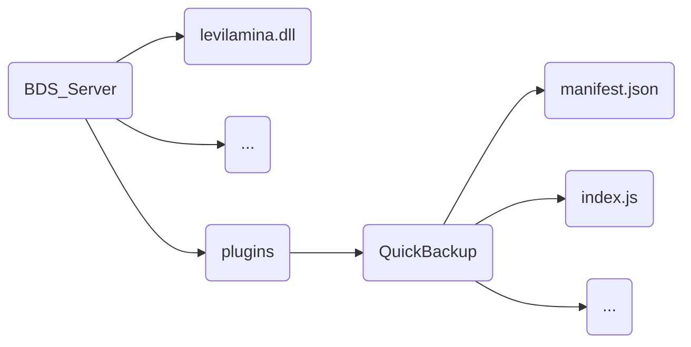

# QuickBackup

# README.md
- en [English](readme/README.en.md)
- zh_CN [简体中文](README.md)

**Introduction**

This plugin runs on a **BDS server** that utilizes **levilamina/LiteloaderBDS**. It helps you perform secure hot backups of your server, ensuring that your archives are never lost. Additionally, it provides a convenient scheduling system, eliminating the need for separate tools to manage timed executions.

**Installation**

For **levilamina**, simply extract the plugin's compressed package and place it in the plugin folder as shown below:

For **LiteloaderBDS**, change the plugin's file extension to `.llplugin` and directly place it in the server's `plugins` folder. After completing these steps, don't forget to restart the server.

**Usage**

This plugin registers the top-level command `/backup` for quick and efficient backup task management. Let's explain how to use the commands:

1. When no parameters are provided, using this command will immediately create an archive backup in your specified target folder.

2. `/backup [add] <cronExpression: string> <scheduleName: string>`
   - `add`: Enumerated option indicating the addition of a backup task.
   - `cronExpression`: Any valid cron expression specifying the execution time for the task. When the specified time arrives, an archive backup will be automatically created in your designated target folder.
   - `scheduleName`: The name of the task, used to differentiate between different tasks.
   - Example: `/backup add "0 0 12 * * ?" test` adds a backup task named "test" that executes daily at 12:00. The server will automatically read the task list from `schedule.json` upon startup, eliminating the need to add tasks every time you enter the server.

3. `/backup [query|cancel] [actionName: string]`
   - `query`: Enumerated option for querying tasks.
   - `cancel`: Enumerated option for canceling tasks.
   - `actionName`: The name of the task to operate on.
   - When using `query` to retrieve tasks without specifying a task name, all tasks will be returned.
   - Similarly, when using `cancel` to cancel tasks without specifying a task name, all tasks will be canceled.
